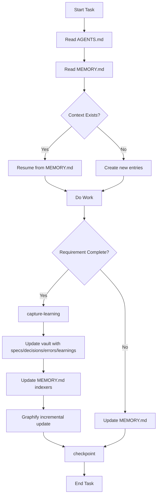

# ai-memory-storager

## Purpose
- Configure and maintain a `MEMORY.md` file as a Map of Content (MOC) for an Obsidian vault
- Establish bidirectional links between `MEMORY.md`, `AGENTS.md`, and the Obsidian vault
- Enforce wikilink syntax (`[[page-name]]`) for all internal references
- Manage work progress persistence across agent sessions
- Integrate with Graphify for knowledge graph visualization
- **Capture learned knowledge** from completed requirements/features into the Obsidian vault to prevent repeated errors and preserve specifications
- **Maintain MEMORY.md** as a living index referencing vault sections
- **Optimize large vaults** with indexer files and Graphify-driven graph generation

## Requirements
- Obsidian vault initialized in the workspace
- `AGENTS.md` file present in the workspace root
- Graphify plugin installed in Obsidian (optional but recommended)

## Configuration

### Memory Structure
```
workspace/
├── AGENTS.md              # Agent instructions & progress tracking (REQUIRED)
├── MEMORY.md              # Map of Content - central index (REQUIRED)
├── .obsidian/             # Obsidian vault configuration
└── vault/                 # Obsidian vault content
    ├── _indexers/         # Domain MOCs for large vault optimization
    │   ├── projects-index.md
    │   ├── decisions-index.md
    │   ├── errors-index.md
    │   ├── specs-index.md
    │   └── learnings-index.md
    ├── projects/
    │   └── project-name/
    │       ├── specs/
    │       ├── decisions/
    │       ├── errors/
    │       └── learnings/
    ├── notes/
    ├── references/
    └── archive/
        └── YYYY-MM-project-name/

### Wikilink Conventions
- **Internal pages**: `[[page-name]]` or `[[page-name|display-text]]`
- **Folder references**: `[[folder/note]]` (Obsidian resolves relative to vault root)
- **External files**: `/path/to/file.md` (classic pointer, not markdown links)
- **NEVER use**: `[text](url)` markdown link syntax

### Vault as Knowledge Store
The Obsidian vault **is** the persistent memory. When a requirement or feature is completed:

1. **Extract learned information**:
   - Specification details (API contracts, data models, constraints)
   - Errors encountered and their resolutions
   - Design decisions and rationale
   - Performance characteristics
   - Integration gotchas

2. **Save to vault** as structured notes:
   ```
   vault/
   ├── projects/
   │   └── project-name/
   │       ├── specs/
   │       │   ├── api-contract.md
   │       │   └── data-model.md
   │       ├── decisions/
   │       │   └── YYYY-MM-DD-decision-title.md
   │       ├── errors/
   │       │   └── error-description-resolution.md
   │       └── learnings/
   │           └── key-insight.md
   ```

3. **Update MEMORY.md** with wikilinks to new vault sections:
   ```markdown
   ## 📁 Projects
   - [[projects/project-name|Project Name]]
     - [[projects/project-name/specs/api-contract|API Contract]]
     - [[projects/project-name/decisions/2026-01-15-auth-strategy|Auth Strategy Decision]]
     - [[projects/project-name/errors/rate-limit-handling|Rate Limit Handling]]
     - [[projects/project-name/learnings/cache-invalidation|Cache Invalidation Pattern]]
   ```

4. **Use Graphify** for graph generation during updates to maintain context relationships.

### Large Vault Optimization Strategies
When the vault grows beyond ~500 notes or graph traversal becomes slow:

#### 1. **Indexer Files (MOCs per Domain)**
Create dedicated Map of Content files as indexers:
```
vault/
├── _indexers/
│   ├── projects-index.md      # [[projects/*]] links
│   ├── decisions-index.md     # [[decisions/*]] links
│   ├── errors-index.md        # [[errors/*]] links
│   ├── specs-index.md         # [[specs/*]] links
│   └── learnings-index.md     # [[learnings/*]] links
```
- Each indexer auto-generates via script or Dataview query
- MEMORY.md links to indexers, not individual notes
- Reduces MEMORY.md size, keeps navigation fast

#### 2. **Graphify-Driven Context Windows**
- Generate subgraphs per task: `graphify --focus [[current-task]] --depth 2`
- Use Graphify tags: `#active`, `#archived`, `#reference`
- Query: `graphify --tag active --format json` for programmatic access
- Update graphs incrementally on `sync-memory`, not full rebuild

#### 3. **Hierarchical Tagging System**
```
#project/project-name
#domain/backend|frontend|infra
#type/spec|decision|error|learning
#status/active|completed|archived
```
- Enables Dataview/Obsidian Search filtering
- Graphify can filter by tag for focused views

#### 4. **Periodic Compaction**
- Monthly: Archive completed project notes to `archive/YYYY-MM-project-name/`
- Replace individual links in MEMORY.md with archive indexer link
- Run `graphify --rebuild` after compaction

#### 5. **Context-Preserving Updates**
When updating vault + MEMORY.md:
```bash
# 1. Generate current context graph
graphify --focus [[current-task]] --depth 3 --output context-graph.json

# 2. Write new vault notes with wikilinks to context graph nodes
# 3. Update MEMORY.md indexers
# 4. Incremental Graphify update
graphify --incremental --input context-graph.json
```
This preserves semantic relationships during growth.

## Rules

### Mandatory Behaviors
1. **On skill activation**: Read `AGENTS.md` and verify `MEMORY.md` exists
2. **On any task start**: Check `MEMORY.md` for existing context and progress
3. **On task completion**: Update `MEMORY.md` with new entries and links
4. **On session end**: Sync progress to `AGENTS.md` and `MEMORY.md`

### Instructions for AI Agents (Delegated)
1. **Session Start**: Run `ai-memory sync-memory` to load context
2. **Read First**: Always read AGENTS.md and MEMORY.md before starting work
3. **Wikilinks Only**: Use `[[page-name]]` or `[[page-name|display]]` for all internal references
4. **No Markdown Links**: NEVER use `[text](url)` syntax
5. **External References**: Use classic pointers `/path/to/file.md`
6. **Task Completion**: Run `ai-memory capture-learning` for specs/decisions/errors/learnings
7. **Session End**: Run `ai-memory checkpoint` to save progress
8. **Periodic**: Run `ai-memory compact-vault` monthly to archive completed work

### Tagging Convention
- Project: `#project/<project-name>`
- Domain: `#domain/backend|frontend|infra|docs`
- Type: `#type/spec|decision|error|learning`
- Status: `#status/active|completed|archived`

### Graphify Context
- Current task graph: `ai-memory graph-context`
- Active items: `graphify --tag active --format json`
- Project graph: `graphify --tag project/<project-name>`

### MEMORY.md Format
```markdown
# MEMORY - Map of Content

## 📋 Active Work
- [[project-name]] - Brief description
- [[task-name]] - Status: in-progress/complete

## 📁 Projects
- [[projects/project-name|Project Name]]
- [[projects/another-project|Another Project]]

## 📝 Notes
- [[notes/topic-name|Topic Name]]
- [[references/source-name|Source Name]]

## 🔗 Cross-References
- [[AGENTS.md|Agent Instructions]]
- [[vault/specific-note|Vault Note]]

## 📊 Progress Log
- YYYY-MM-DD: Session summary with wikilinks to relevant pages
```

### AGENTS.md Integration
The `AGENTS.md` must contain:
- Current task reference via wikilink: `Current Task: [[task-name]]`
- Memory checkpoint: `Last Sync: [[MEMORY.md#progress-log|Progress Log]]`
- Vault path: `Vault: ./vault`

## Commands

### `init-memory`
Initialize the memory system:
- Create `MEMORY.md` with default structure
- Verify `AGENTS.md` exists and has required fields
- Create vault folder structure including `_indexers/` and project subfolders (specs/, decisions/, errors/, learnings/)
- Create empty indexer files in `_indexers/`
- Register in `.obsidian/app.json` if needed
- Initialize Graphify configuration

### `sync-memory`
Synchronize memory state:
- Read `AGENTS.md` for current task
- Update `MEMORY.md` progress log
- Create/update wikilinks for new content
- Regenerate indexer files (`_indexers/*-index.md`) via Dataview/query
- **Incremental Graphify update** preserving context relationships
- Output context graph for current task: `graphify --focus [[current-task]] --depth 3`

### `checkpoint`
Save current work progress:
- Append entry to `MEMORY.md#Progress Log`
- Update `AGENTS.md` with current task wikilink
- Stage vault changes for git

### `capture-learning <project> <type> <title> <content>`
Save learned knowledge from completed requirement/feature:
- `type`: spec | decision | error | learning
- Creates note in `vault/projects/<project>/<type>/<title>.md`
- Adds wikilink to `MEMORY.md` under project section
- Updates relevant indexer (`_indexers/<type>-index.md`)
- Triggers incremental Graphify update

### `compact-vault [--month YYYY-MM]`
Archive completed work:
- Moves completed project folders to `archive/YYYY-MM-project-name/`
- Updates MEMORY.md to link archive indexer
- Rebuilds Graphify index
- Generates compaction report

### `vault-link <target> <alias>`
Create a wikilink entry in MEMORY.md:
- Adds `[[target|alias]]` to appropriate section
- Creates target file if it doesn't exist
- Updates backlinks in target file

## Workflow



### Detailed Cycle
1. **Start**: `sync-memory` → reads AGENTS.md + MEMORY.md + Graphify context graph
2. **Work**: Agent operates, references vault via wikilinks
3. **Complete**: `capture-learning` → writes to vault, updates MEMORY.md indexers
4. **Sync**: `sync-memory` → incremental Graphify, updates AGENTS.md
5. **Checkpoint**: `checkpoint` → progress log, git stage
6. **Periodic**: `compact-vault` → archive, rebuild graphs

## Implementation

This skill provides a **portable bash implementation** that works in any project without external dependencies (except Obsidian + Graphify).

### Files Structure
```
ai-memory-storager/
├── SKILL.md                 # This documentation
├── config/
│   └── default.conf         # Default configuration template
├── scripts/
│   └── ai-memory.sh         # Main implementation (all commands)
├── install.sh               # Project installer
└── templates/               # (Optional) Project templates
```

### Commands Implemented
All commands from the specification are implemented in `scripts/ai-memory.sh`:

| Command | Description |
|---------|-------------|
| `init-memory` | Initialize vault, MEMORY.md, AGENTS.md, indexers, Graphify |
| `sync-memory` | Read AGENTS.md, update MEMORY.md, regenerate indexers, incremental Graphify |
| `checkpoint` | Append to progress log, update AGENTS.md, stage git |
| `capture-learning <project> <type> <title> [content]` | Save spec/decision/error/learning to vault, update MEMORY.md + indexers + Graphify |
| `compact-vault [YYYY-MM]` | Archive completed projects, rebuild Graphify |
| `vault-link <target> [alias]` | Add wikilink to MEMORY.md, create target file |
| `generate-indexers [type]` | Regenerate `_indexers/*-index.md` via file scan |
| `graph-context [task]` | Generate Graphify subgraph JSON for task context |

## Installation (Portable)

### Option 1: NPX Skills CLI (Recommended)
```bash
npx skills add <github-url>
```
This will automatically download and install the memory storager into your current project.

### Option 2: Install via bash script (Manual)
```bash
# From this skill directory
./install.sh /path/to/your/project

# Or from your project root
/path/to/ai-memory-storager/install.sh
```

This creates:
```
your-project/
├── ai-memory              # Wrapper script (executable)
├── .ai-memory/
│   ├── scripts/ai-memory.sh
│   ├── config/default.conf
│   └── aliases.sh         # Shell shortcuts (optional)
└── .ai-memory.conf        # Project config (created on init)
```

### Option 2: Global install (opencode skill)
```bash
cp -r ai-memory-storager ~/.opencode/skill/ai-memory-storager
# Then use: opencode skill run ai-memory-storager <command>
```

### Option 3: Direct script usage
```bash
/path/to/ai-memory-storager/scripts/ai-memory.sh <command>
```

## Usage

### Quick Start
```bash
cd your-project
./ai-memory init-memory
./ai-memory sync-memory
# ... do work ...
./ai-memory capture-learning my-project decision "Auth Strategy" "Use JWT with refresh tokens..."
./ai-memory checkpoint
```

### With Shell Aliases
```bash
source .ai-memory/aliases.sh
aim-init
aim-sync
aim-learn my-project error "Rate Limit" "Handle 429 with exponential backoff..."
aim-checkpoint
```

### Configuration
Copy `.ai-memory/config/default.conf` to `.ai-memory.conf` in your project root and customize:
```bash
# Project-specific overrides
PROJECT_NAME="my-awesome-project"
VAULT_PATH="./vault"
GRAPHIFY_CMD="npx graphify"  # or your Graphify command
GIT_AUTO_STAGE=true
```

## Requirements
- **Bash 4.0+** (Linux, macOS, WSL, Git Bash)
- **Obsidian** (v1.0+) for vault viewing
- **Graphify plugin** (optional but recommended for graphs)
- **Git** (optional, for auto-staging)

## Portability Notes
- **No Node/Python/Runtime dependencies** - pure bash
- **Configuration via .ai-memory.conf** - project-specific, not global
- **Wrapper script** - runs from project root, finds its own files
- **Relative paths** - works from any subdirectory via wrapper
- **Graceful degradation** - Graphify/git features auto-disable if not available

## Integration with OpenCode
Add to your `.opencode/skill/ai-memory-storager/SKILL.md` or reference the installed wrapper:
```yaml
# In your project's agent config
skills:
  - ai-memory-storager
```
Then agents can run:
```bash
ai-memory sync-memory
ai-memory capture-learning ...
```

## Dependencies
- Obsidian (v1.0+)
- Graphify plugin (recommended)
- Git (for version control)

## License
MIT